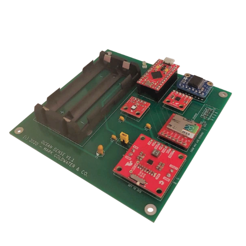

# Ocean_Sense

Ocean Sense is an ocean-sensing platform which can be placed on a buoy or other ocean science apparatus and sent out to sea for about one week at a time. Many ocean science experiments are run off of buoys or other devices that stand alone in the field for an extended period of time. This board serves as a packaged sensor set that measures and logs three local conditions during the experiments: **temperature, humidity**, and **acceleration**. The board sits ontop of a buoy or equivalent flotation device for the duration of an experiment and then is retrieved. To travel into the depths of the ocean, an appropriate case will need to be engineered.

